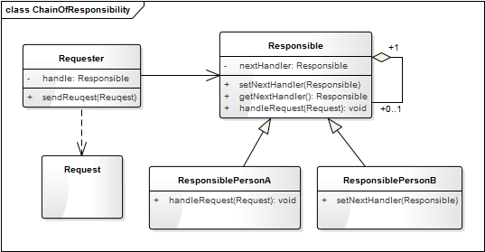

## 05 职责模式：我的假条去哪了

【故事剧情】

> 周五了，Tony 因为家里有一些重要的事需要回家一趟，于是向他的领导 Eren 请假，填写完假条便交给了 Eren。
> 得到的回答却是：“这个假条我签不了，你得等部门总监同意！” 
> Tony 一脸疑惑：“上次去参加 SDCC 开发者大会请了一天假不就是您签的吗？” 
> Eren：“上次你只请了一天，我可以直接签。现在你是请五天，我要提交给部门总监，等他同意才可以。”
> 
> Tony：“您怎么不早说啊？” 
> Eren：“你也没问啊！下次请假要提前一点……”
> 
> Tony 哪管这些啊！对他来说，每次请假只要把假条交给 Eren，其他的事情都交给领导去处理吧！
> 
> 事实却是，整个请假的过程要走一套复杂的流程：
> 
> 1.  小于等于2天，直属领导签字，提交行政部门；
> 2.  大于2天，小于等于5天，直属领导签字，部门总监签字，提交行政部门；
> 3.  大于5天，小于等于1月，直属领导签字，部门总监签字，CEO 签字，提交行政部门。

### 用程序来模拟生活

对于 Tony 来说，他只需要每次把假条交给直属领导，其他的繁琐流程他都可以不用管，所以他并不知道请假流程的具体细节。
但请假会影响项目的进展和产品的交互，所以请假其实是一种责任担当的过程：你请假了，必然会给团队或部门增加工作压力，所以领导肯定会控制风险。
请假的时间越长，风险越大，领导的压力和责任也越大，责任人也就越多，责任人的链条也就越长。

程序来源于生活，我们可以用程序来模拟这一个有趣的场景。

源码示例：
```Python
class Person:
    "请假申请人"
    def __init__(self, name, dayoff, reason):
        self.__name = name
        self.__dayoff = dayoff
        self.__reason = reason
        self.__leader = None

    def getName(self):
        return self.__name

    def getDayOff(self):
        return self.__dayoff

    def getReason(self):
        return self.__reason

    def setLeader(self, leader):
        self.__leader = leader

    def reuqest(self):
        print(self.__name, "申请请假", self.__dayoff, "天。请假事由：", self.__reason)
        if( self.__leader is not None):
            self.__leader.handleRequest(self)

class Manager:
    "公司管理人员"

    def __init__(self, name, title):
        self.__name = name
        self.__title = title
        self.__nextHandler = None

    def getName(self):
        return self.__name

    def getTitle(self):
        return self.__title

    def setNextHandler(self, nextHandler):
        self.__nextHandler = nextHandler

    def getNextHandler(self):
        return self.__nextHandler

    def handleRequest(self, person):
        pass

class Supervisor(Manager):
    "主管"

    def __init__(self, name, title):
        super().__init__(name, title)

    def handleRequest(self, person):
        if(person.getDayOff() <= 2):
            print("同意", person.getName(), "请假，签字人：", self.getName(), "(", self.getTitle(), ")")
        nextHander = self.getNextHandler()
        if(nextHander is not None):
            nextHander.handleRequest(person)

class DepartmentManager(Manager):
    "部门总监"
    def __init__(self, name, title):
        super().__init__(name, title)

    def handleRequest(self, person):
        if(person.getDayOff() >2 and person.getDayOff() <= 5):
            print("同意", person.getName(), "请假，签字人：", self.getName(), "(", self.getTitle(), ")")
        nextHander = self.getNextHandler()
        if(nextHander is not None):
            nextHander.handleRequest(person)

class CEO(Manager):
    "CEO"

    def __init__(self, name, title):
        super().__init__(name, title)

    def handleRequest(self, person):
        if (person.getDayOff() > 5 and person.getDayOff() <= 22):
            print("同意", person.getName(), "请假，签字人：", self.getName(), "(", self.getTitle(), ")")
        nextHander = self.getNextHandler()
        if (nextHander is not None):
            nextHander.handleRequest(person)

class Administrator(Manager):
    "行政人员"

    def __init__(self, name, title):
        super().__init__(name, title)

    def handleRequest(self, person):
        print(person.getName(), "的请假申请已审核，情况属实！已备案处理。处理人：", self.getName(), "(", self.getTitle(), ")\n")
        nextHander = self.getNextHandler()
```
    
测试代码：
```Python
def testChainOfResponsibility():
    directLeader = Supervisor("Eren", "客户端研发部经理")
    departmentLeader = DepartmentManager("Eric", "技术研发中心总监")
    ceo = CEO("Helen", "创新文化公司CEO")
    administrator = Administrator("Nina", "行政中心总监")
    directLeader.setNextHandler(departmentLeader)
    departmentLeader.setNextHandler(ceo)
    ceo.setNextHandler(administrator)

    sunny = Person("Sunny", 1, "参加MDCC大会。")
    sunny.setLeader(directLeader)
    sunny.reuqest()
    tony = Person("Tony", 5, "家里有紧急事情！")
    tony.setLeader(directLeader)
    tony.reuqest()
    pony = Person("Pony", 15, "出国深造。")
    pony.setLeader(directLeader)
    pony.reuqest()
```
    

输出结果：
```
Sunny 申请请假 1 天。请假事由： 参加MDCC大会。
同意 Sunny 请假，签字人： Eren ( 客户端研发部经理 )
Sunny 的请假申请已审核，情况属实！已备案处理。处理人： Nina ( 行政中心总监 )

Tony 申请请假 5 天。请假事由： 家里有紧急事情！
同意 Tony 请假，签字人： Eric ( 技术研发中心总监 )
Tony 的请假申请已审核，情况属实！已备案处理。处理人： Nina ( 行政中心总监 )

Pony 申请请假 15 天。请假事由： 出国深造。
同意 Pony 请假，签字人： Helen ( 创新文化公司CEO )
Pony 的请假申请已审核，情况属实！已备案处理。处理人： Nina ( 行政中心总监 )
```
    

### 从剧情中思考职责模式

从请假这个示例中我们发现，对于 Tony 来说，他并不需要知道假条处理的具体细节，甚至不需要知道假条去哪儿了，他只需要知道假条有人会处理。
而假条的处理流程是一手接一手的责任传递，处理假条的所有人构成了一条 **责任的链条**。
链条上的每一个人只处理自己职责范围内的请求，对于自己处理不了请求，直接交给下一个责任人。
这就是程序设计中职责模式的核心思想。


**职责模式**： 避免请求发送者与接收者耦合在一起，让多个对象都有可能接收请求，将这些对象连接成一条链，并且沿着这条链传递请求，直到有对象处理它为止。
职责模式也称为责任链模式，它是一种对象行为型模式。

职责链模式将请求的发送者和接受者解耦了。
客户端不需要知道请求处理者的明确信息和处理的具体逻辑，甚至不需要知道链的结构，它只需要将请求进行发送即可。

在职责链模式中我们可以随时随地的增加或者更改一个责任人，甚至可以更改责任人的顺序，增加了系统的灵活性。
但是有时候可能会导致一个请求无论如何也得不到处理，它会被放置在链末端。

### 职责模式的模型抽象

#### 代码框架

上面的示例代码还是相对比较粗糙，我们可以对它进行进一步的重构和优化，抽象出职责模式的框架模型。
```Python
class Request:
    "请求(内容)"

    def __init__(self, name, dayoff, reason):
        self.__name = name
        self.__dayoff = dayoff
        self.__reason = reason
        self.__leader = None

    def getName(self):
        return self.__name

    def getDayOff(self):
        return self.__dayoff

    def getReason(self):
        return self.__reason

class Responsible:
    "责任人的抽象类"

    def __init__(self, name, title):
        self.__name = name
        self.__title = title
        self.__nextHandler = None

    def getName(self):
        return self.__name

    def getTitle(self):
        return self.__title

    def setNextHandler(self, nextHandler):
        self.__nextHandler = nextHandler

    def getNextHandler(self):
        return self.__nextHandler

    def handleRequest(self, request):
        pass
```
    
#### 类图

上面的代码框架可用类图表示如下：



#### 基于框架的实现

有了上面的代码框架之后，我们要实现示例代码的功能就会更简单了，代码也会更加优雅。最开始的示例代码我们假设它为 version 1.0，那么再看看基于框架的 version 2.0 吧。
```Python
class Person:
    "请求者"

    def __init__(self, name):
        self.__name = name
        self.__leader = None

    def setName(self, name):
        self.__name = name

    def getName(self):
        return self.__name

    def setLeader(self, leader):
        self.__leader = leader

    def getLeader(self):
        return self.__leader

    def sendReuqest(self, request):
        print(self.__name, "申请请假", request.getDayOff(), "天。请假事由：", request.getReason())
        if (self.__leader is not None):
            self.__leader.handleRequest(request)

class Supervisor(Responsible):
    "主管"

    def __init__(self, name, title):
        super().__init__(name, title)

    def handleRequest(self, request):
        if (request.getDayOff() <= 2):
            print("同意", request.getName(), "请假，签字人：", self.getName(), "(", self.getTitle(), ")")
        nextHander = self.getNextHandler()
        if (nextHander is not None):
            nextHander.handleRequest(request)

class DepartmentManager(Responsible):
    "部门总监"

    def __init__(self, name, title):
        super().__init__(name, title)

    def handleRequest(self, request):
        if (request.getDayOff() > 2 and request.getDayOff() <= 5):
            print("同意", request.getName(), "请假，签字人：", self.getName(), "(", self.getTitle(), ")")
        nextHander = self.getNextHandler()
        if (nextHander is not None):
            nextHander.handleRequest(request)

class CEO(Responsible):
    "CEO"

    def __init__(self, name, title):
        super().__init__(name, title)

    def handleRequest(self, request):
        if (request.getDayOff() > 5 and request.getDayOff() <= 22):
            print("同意", request.getName(), "请假，签字人：", self.getName(), "(", self.getTitle(), ")")
        nextHander = self.getNextHandler()
        if (nextHander is not None):
            nextHander.handleRequest(request)

class Administrator(Responsible):
    "行政人员"

    def __init__(self, name, title):
        super().__init__(name, title)

    def handleRequest(self, request):
        print(request.getName(), "的请假申请已审核，情况属实！已备案处理。处理人：", self.getName(), "(", self.getTitle(), ")\n")
        nextHander = self.getNextHandler()
```
    

测试代码需要稍微修改一下：
```Python
def testChainOfResponsibility1():
    directLeader = Supervisor("Eren", "客户端研发部经理")
    departmentLeader = DepartmentManager("Eric", "技术研发中心总监")
    ceo = CEO("Helen", "创新文化公司CEO")
    administrator = Administrator("Nina", "行政中心总监")
    directLeader.setNextHandler(departmentLeader)
    departmentLeader.setNextHandler(ceo)
    ceo.setNextHandler(administrator)

    sunny = Person("Sunny")
    sunny.setLeader(directLeader)
    sunny.sendReuqest(Request(sunny.getName(), 1, "参加MDCC大会。"))
    tony = Person("Tony")
    tony.setLeader(directLeader)
    tony.sendReuqest(Request(tony.getName(), 5, "家里有紧急事情！"))
    pony = Person("Pony")
    pony.setLeader(directLeader)
    pony.sendReuqest(Request(pony.getName(), 15, "出国深造。"))
```
    

自己跑一下，会发现输出结果和之前的是一样的。

#### 模型说明

- 设计要点

在设计职责模式的程序时要注意以下几点：

1.  **请求者与请求内容**：谁要发送请求？发送请求的对象称为请求者。请求的内容通过发送请求时的参数进行传递。
2.  **有哪些责任人**：责任人是构成责任链的关键要素。请求的流动方向是链条中的线，而责任人则是链条上的结点，线和结点才构成了一条链条。
3.  **对责任人进行抽象**：真实世界中的责任人会多种多样，纷繁复杂，会有不同的职责和功能；但他们也有一个共同的特征——都可以处理请求。
    所以需要对责任人进行抽象，使他们具有责任的可传递性。
4.  **责任人可自由组合**：责任链上的责任人可以根据业务的具体逻辑进行自由的组合和排序。

#### 优缺点

- 优点：

1.  降低耦合度。它将请求的发送者和接受者解耦。
2.  简化了对象。使得对象不需要知道链的结构。
3.  增强给对象指派职责的灵活性。通过改变链内的成员或者调动它们的次序，允许动态地新增或者删除责任人。
4.  增加新的处理类很方便。

- 职责模式的缺点：

1.  不能保证请求一定被接收。
2.  系统性能将受到一定影响，而且在进行代码调试时不太方便，可能会造成循环调用。

### 应用场景

1.  有多个对象可以处理同一个请求，具体哪个对象处理该请求由运行时刻自动确定。
2.  请求的处理具有明显的一层层传递关系。
3.  请求的处理流程和顺序需要程序运行时动态确定。
